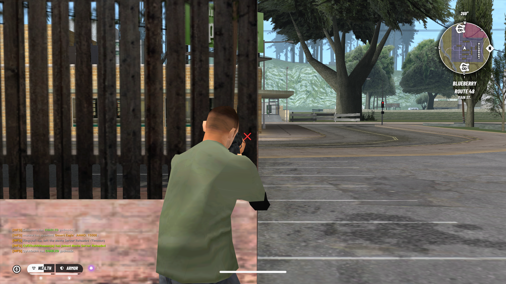

# Proper Weapon Ray-casting (aimfix.asi)

Third-person aiming fixes for GTA San Andreas 1.0 US, with an obstruction marker and bullet tracers. Works alongside SA-MP and open.mp clients.



## What it does

- **Shots hit what you aim at.** GTA fires third-person shots from the camera, so a wall between the gun and the target can be ignored, or the bullet can land beside the crosshair. With this mod, the shot starts at the gun and aims at the point under the crosshair. Cover in front of the gun blocks the bullet.
- **Obstruction marker.** While aiming, the mod predicts the shot. If something blocks it before the crosshair target, an X is drawn at the exact impact point. The X sits slightly off the surface, faces the camera, scales with distance and fades in and out.
- **Crosshair hiding.** The crosshair is hidden while the X is shown and returns as soon as the shot is clear.
- **Bullet tracers.** Each aimed or hip-fired shot draws a line from the gun to the real impact point, using GTA's own tracer renderer. Other players' shots get tracers too. NPC shots do not.
- **Multiplayer safe.** The mod identifies the shooter from GTA's firing code, so other players' shots are never re-aimed. samp's own hooks are chained rather than replaced, and the mod re-attaches if samp patches the same call later.

Nothing in the game's animations, IFP files or network protocol is changed.

## Requirements

- GTA San Andreas **1.0 US** (`gta_sa.exe`). Other versions are not supported. The mod checks each call site before patching and skips any that do not match.
- An ASI loader, such as Ultimate ASI Loader, or the one bundled with SA-MP or MoonLoader installs.
- Optional: SA-MP 0.3.7-R1 or 0.3.DL-R1 (developed against 0.3.DL), or open.mp.

## Installation

Use the release zip, or copy the files by hand:

1. Copy `aimfix.asi` into the game folder, next to `gta_sa.exe`.
2. Copy `aimfix.txd` into `models\txd\`.
3. Start the game once. `aimfix.ini` and `aimfix.log` are created next to `gta_sa.exe`.

`files/aimfix.ini` in this repository has the default settings.

## Configuration

Edit `aimfix.ini` while the game is closed. Missing keys use the defaults shown.

```ini
[Aim]
AlignShots=1        ; 1 = aim at the crosshair hit point; 0 = GTA default (fires from the camera)
ShotFrom=Muzzle     ; Muzzle = from the barrel; Origin = GTA's point (above the gun, clears low cover)

[Marker]
Enabled=1           ; the X marker
HideCrosshair=1     ; hide the crosshair while the X is shown
Txd=aimfix          ; texture dictionary in models\txd\
Texture=x           ; texture name inside it
Size=0.18           ; world metres
MinPx=10
MaxPx=42            ; on-screen size limits in pixels
Colour=FF3C3CE6     ; RRGGBBAA
MaxDistance=80      ; metres from the camera
Tolerance=0.3       ; how far short of the target the bullet must stop to count as blocked
Smoothing=20        ; how fast the X follows (higher = faster)
Fade=12             ; fade speed

[Tracer]
Enabled=1
Others=1            ; show other players' tracers
Radius=0.02         ; line thickness in metres
TimeMs=300          ; how long the line stays, in milliseconds
Alpha=200           ; 0-255
```

Tracer colour cannot be changed. GTA's tracer renderer uses a fixed colour.

## Building

Use the MSVC x86 toolchain (Visual Studio Build Tools, "Desktop development with C++"):

```bat
cl /nologo /LD /O2 /MT /W4 /EHsc /std:c++17 src\aimfix.cpp /Fe:aimfix.asi /link /DLL
```

Pushing a tag such as `v1.0.0` runs `.github/workflows/release.yml`. It builds both files, packages them with the README and LICENSE, and attaches the zip to a GitHub release.

## How it works

The mod replaces five GTA SA calls with jumps to its own code. Each replaced call still runs the original through a chained pointer.

| Address | Call | Used for |
|---|---|---|
| `0x7403BE` | `CCamera::Find3rdPersonCamTargetVector` in `CWeapon::FireInstantHit` | shot start and aim point |
| `0x740721` | bullet line-of-sight, aimed shots | aimed tracers |
| `0x740B69` | bullet line-of-sight, hip-fire shots | hip-fire tracers |
| `0x53E4FF` | `CHud::Draw` in `Render2dStuff` | drawing the marker |
| `0x58FBBF` | `CHud::DrawCrossHairs` | hiding the crosshair |

The shooter is read from the `EBP` register at the first two call sites, then compared with the local player. The obstruction check uses `CWorld::ProcessLineOfSight` with the same collision flags GTA uses for a bullet.

## Limitations

- **Collision, not visuals.** The marker and shot blocking use GTA's collision models, which is what bullets hit. A visible detail without collision does not block a bullet.
- **No spread prediction.** The marker shows the aim point, not the random spread GTA adds to each shot.
- **Aimed and hip-fire shots only.** Drive-by shots, rockets, thrown weapons and first-person scopes are not changed.
- **Muzzle start can clip.** With `ShotFrom=Muzzle` the shot starts at the barrel, so a barrel pressed into thin cover may still hit it. Use `ShotFrom=Origin` to shoot over low cover.
- **Lightly tested.** Developed against a small set of in-game test cases. Bug reports with `aimfix.log` attached are welcome.

## Troubleshooting

Check `aimfix.log`. A healthy start looks like this:

```
aimfix.asi loaded
settings: align=1 marker=1 txd=aimfix:x size=0.18 px=10..42 colour=FF3C3CE6
shot alignment: hooked 0x7403BE (chained to 0x00514970)
marker: hooked 0x53E4FF (chained to 0x0058FAE0)
crosshair: hooked 0x58FBBF (chained to 0x0058E020)
tracer (aimed): hooked 0x740721 (chained to 0x0056BA00)
tracer (hipfire): hooked 0x740B69 (chained to 0x0056BA00)
marker: loaded aimfix:x
```

- **`not a call` in the log:** the game is not 1.0 US, or another mod has patched that spot.
- **`marker: ... not found`:** `aimfix.txd` is not in `models\txd\`.
- **Crosshair stays visible on 0.3.DL:** samp may have re-hooked the crosshair call after aimfix. A second `crosshair: hooked` line appears in that case.

## License

Licensed under the [GNU Affero General Public License v3.0](LICENSE). If you run a modified version on a public server, you must offer its source to the players who connect.
